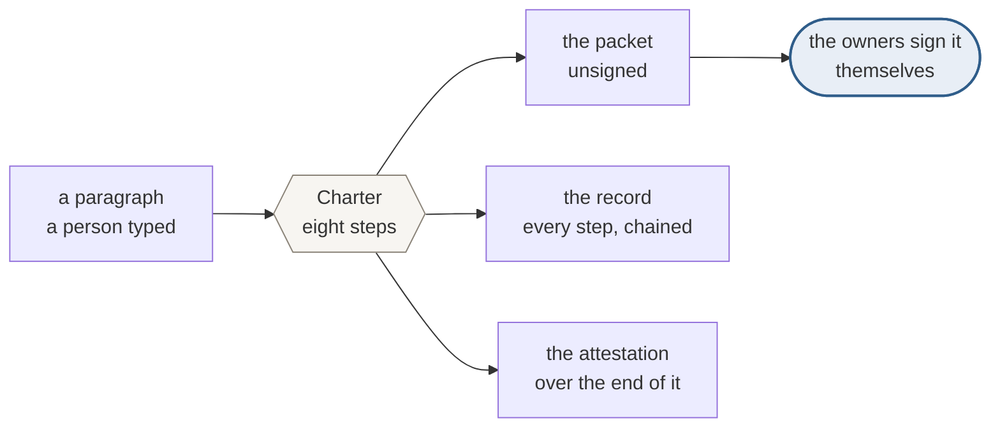
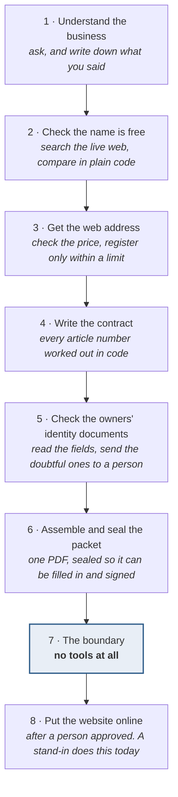
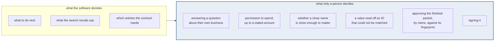
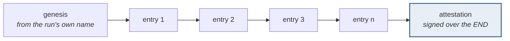
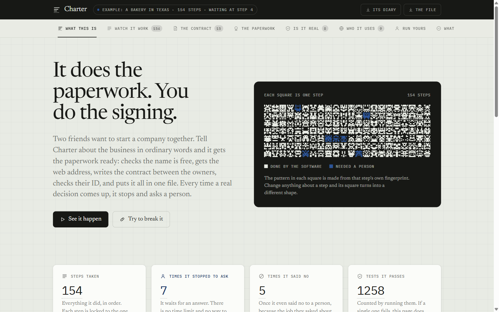
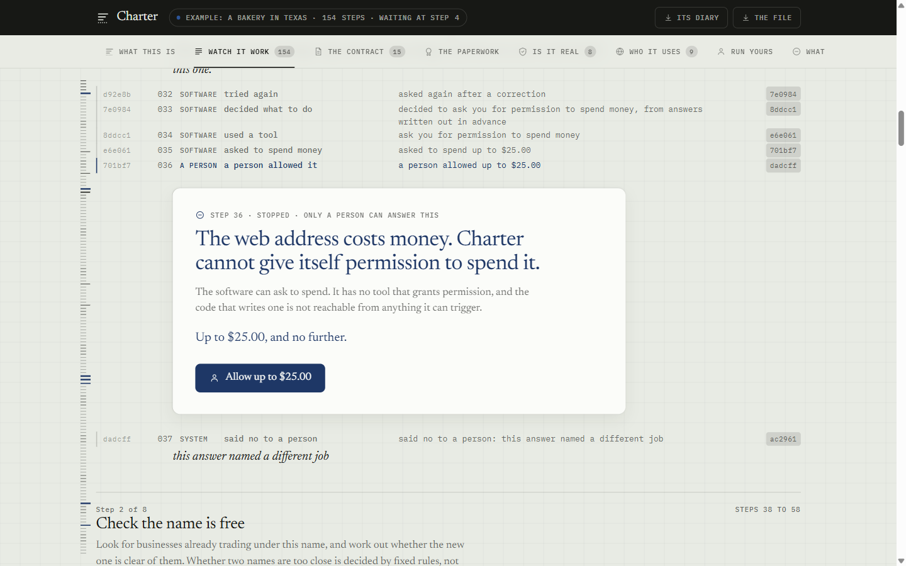
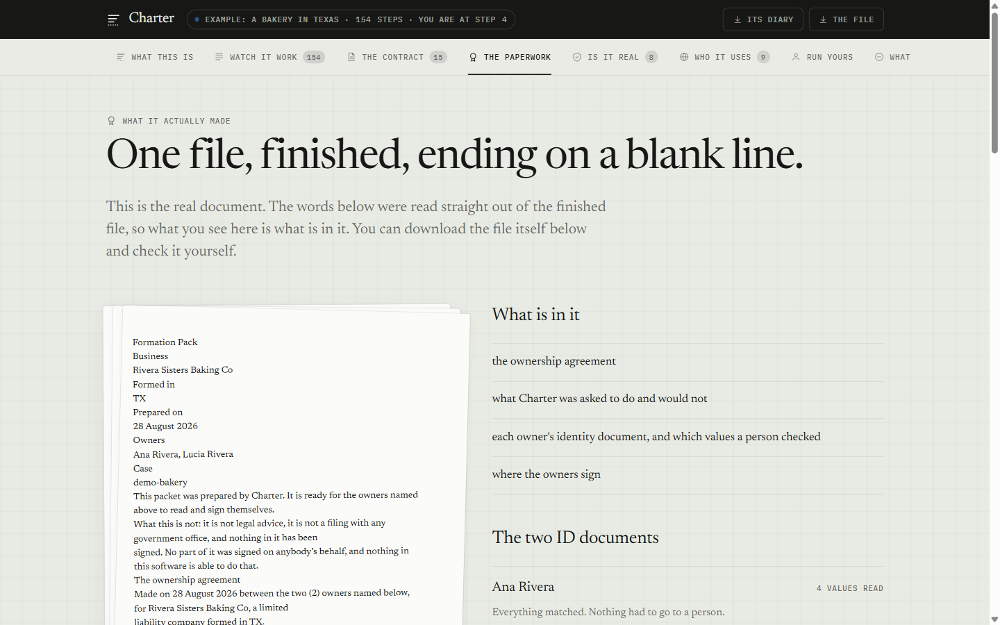
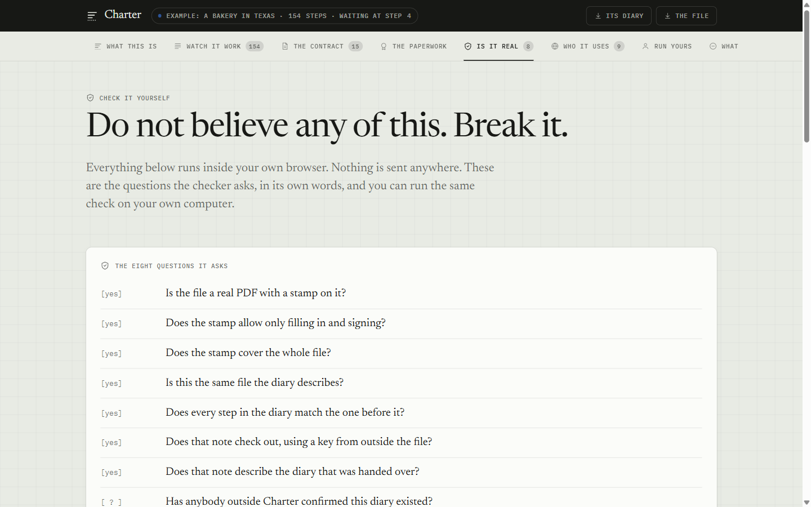
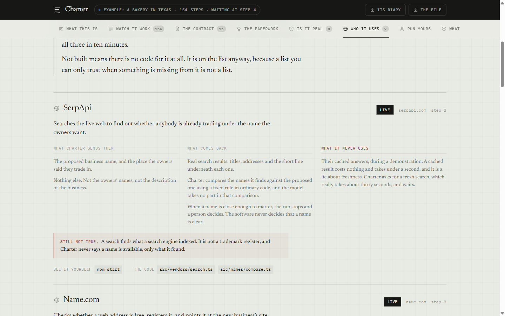

<p align="center">
  
</p>

# Charter

**From idea to legally alive.**

## → **[charter-217o.onrender.com](https://charter-217o.onrender.com)**

It is running right now. Nothing to install, no account, no key. Eight tabs.
Seven of them replay one real run step by step, and one, "Run yours", lets you put
in your own business and watch Charter work on it, stopping to ask you every time a
real decision comes up.


You describe your business in plain English. Charter prepares everything around the
government filing — it researches the name, secures a web address and points it at
the new site, drafts the ownership agreement, checks each owner's identity documents,
and assembles one signable pack.

Then it stops, and hands the pack to the owners to sign **themselves**.

Built for businesses with **more than one owner**. Forming a business alone is
already solved and already free. Everything hard lives in the second owner — because
the difficulty was never the paperwork, it is writing down an agreement between
people who trust each other completely today and might not in three years.

**Topics:** `ai-agent` · `llm-tools` · `legal-tech` · `llc-formation` ·
`operating-agreement` · `tamper-evident` · `append-only-log` · `hash-chain` ·
`ed25519` · `human-in-the-loop` · `agent-safety` · `pdf-generation` · `pdf-signing` ·
`postgresql` · `pglite` · `typescript` · `gemini` · `groq` · `no-dependencies` ·
`ueta` · `esign-act`

---

## What it actually does



The blue box is the one thing this software will not do for you, and cannot be
configured to do. Everything else is the software's job.

### The eight steps



**Step seven has no tools.** Not "tools it is discouraged from using" — the list is
empty, so there is nothing for the model to call and nothing to argue with. The run
stops there and waits for a person to approve the packet, naming it by its own
fingerprint. That step exists to be empty.

### Where a person is needed, and why each one



The first five stop the run: it waits, and does not guess while it waits. The sixth
never comes back to the software at all.

### How the record is put together



Each entry carries the fingerprint of the one before it, so changing anything in the
middle breaks every link after it and the checker names the exact entry. The one
thing a chain cannot catch on its own is entries removed from the **end**, because a
shortened chain is still a valid chain — which is what the attestation is for, and
why it is drawn separately.

---

## What it looks like

Six real screens. Nothing here is a mockup, a mock-up of a
mockup, or a picture arranged to look better than the thing. The first five are the run this
repository ships, and every number in them was produced by that run. They are on
your own machine thirty seconds after `npm install`, with `npm run serve`. The
sixth is the deployed site working on a business typed in a few minutes earlier.



**The front page.** Each of those 154 squares is one step of one real run, and its
pattern is drawn from that step's own fingerprint — change anything about a step
and its square changes shape. The blue ones are the seven places the software
stopped and waited for a person. The four numbers underneath are counted, not
typed: the test count comes from running the tests while the page is being built,
and if one had failed the page would not exist.



**The moment the whole project is about.** Read down: the software tries to buy a
web address during the wrong step and is refused. It corrects itself, asks a person
for permission instead, and stops. It cannot grant itself that permission — there
is no tool that grants one, and the code that writes one is not reachable from
anything the model can trigger, which a test proves by following every import in
the project. Two lines below the card, the software says **no to a person**,
because the answer they gave named a different job.



**What it actually made.** One file, and the words on the left were read back out of
the finished PDF rather than typed onto the page. It ends on a blank line, because
the signatures are not the software's to make. The pack says so in its own first
paragraph: nothing in it has been signed, and this software is not able to do that.



**The page that argues against itself.** Eight questions, run inside your own
browser against files you can download. Seven come back yes. The eighth comes back
`[ ? ]` — has anybody outside Charter confirmed this record existed at the time it
claims? Nobody has. That one stays a question mark rather than being quietly
dropped, because a checklist that only shows the questions it passes is an advert.



**Every outside company, including what we refuse to use.** Nine of them, each with
three columns, and the third is the one a feature list would never have. Each is
marked **live**, **written but never called**, or **not built** — three fixed words,
enforced by a test, so a vaguer fourth one cannot appear. Nothing may be called live
without naming a command a stranger can run to prove it.

![The run panel on the deployed site, stopped, headed 'only a person can answer this' and asking 'allow up to $15.00? [y/N]' with a Yes and a No button. Below it the feed reads: Charter wants to spend up to $15.00 to register Two Spokes Bicycle Repair and secure its web address. It cannot give itself permission.](site/shots/06-stopped-and-asking.png)

**The other five pictures are the recorded run. This one is not.** It is the
deployed site, working on a business typed into it a few minutes before the picture
was taken, with the outside companies switched on rather than standing in. It has
stopped, because buying a web address costs money and the software cannot give
itself permission to spend any. The line underneath says the registrar is on its
practice account, so nothing is charged there either.

---

## Try it

There are four ways in, and they need different things.

| | What it needs | What you get |
| --- | --- | --- |
| [the live site](https://charter-217o.onrender.com) | **nothing at all** | everything below, in a browser, with no install |
| `npm run agent:demo` | nothing at all | one business through all eight steps, recorded |
| `npm run serve` | nothing, or a free key | the same website, on your own machine |
| `npm start` | a free model key | your own idea, in a terminal |

The first one is the fastest way to judge this, and it is the same code as the
rest: the site running there is `npm run serve`, built from this repository, and
it refuses to deploy if a single one of the tests fails.

### 1. The recorded walkthrough — no account, no key, no network

```bash
npm install
npm run record:demo     # the record, and what it can and cannot prove
npm run agent:demo      # one business through all eight stages, start to finish
```

### 2. The website, and running your own idea in it

```bash
npm run serve           # then open the address it prints
```

Six tabs replay the run above and need nothing. The seventh is different: you type
what your business is, and Charter works on it for real, stopping to ask you at
every one of the five places above.

It is open to anybody, so it counts: six runs a day for everybody together, two per
person, one at a time. Those numbers are what the free allowances behind it can
carry — one run uses about twelve web searches and the search allowance is 250 a
**month**. Every refusal says which limit, why it is there, and when it lifts.

### 3. Your own idea, in a terminal

```bash
npm start
```

Needs a free model key from `aistudio.google.com/apikey` in `.env` as
`GEMINI_API_KEY`, and `REPLAY_MODE=false`. Without one it stops and says so, rather
than quietly replaying the bakery and calling it your run.

### What the recorded walkthrough shows

`npm run record:demo` runs a real PostgreSQL engine inside the Node process and
shows five things:

1. A record being written — five entries, each carrying the fingerprint of the one
   before it.
2. Somebody altering entry three. The checker names exactly which entry changed,
   and shows the fingerprint it expected against the one it found.
3. The database refusing the alteration. Not our code being careful — a rule
   inside PostgreSQL, which returns `restrict_violation`. Nothing gets around it by
   accident or through any ordinary code path. Somebody holding the connection
   string can still switch it off deliberately, and **that is exactly why the
   fingerprint chain exists**: they cannot then hide what they did. We tested both
   routes rather than assuming, closed the one that could be closed, and say so.
4. **The one thing the chain cannot catch on its own.** Drop the last two entries
   and the chain still verifies perfectly, because a shortened chain is a valid
   chain. The attestation catches it. We show this rather than hiding it.
5. The same question asked twice, reaching the network once.

Everything else:

```bash
npm test          # 1,297 tests
npm run typecheck
npm run git:check # proves nothing secret is publishable, before every commit
npm run settings:check  # every setting either does something, or says it does not
```

`npm run agent:demo` leaves five files in `out/`:

| File | What it is |
| --- | --- |
| `pack.pdf` | The Formation Pack. A real sealed multi-page PDF, at the permission level that allows filling in and signing and nothing else |
| `agreement.docx` | The same agreement, editable, for taking to somebody you trust before anybody signs anything |
| `record.jsonl` | Every entry of the run, in order, each carrying the fingerprint of the one before it |
| `attestation.json` | Vouches for the END of that record, which the chain cannot do on its own |
| `report.html` | One page. Open it in a browser — what the law does if you write nothing down, everything that happened and who caused it, and every refusal |

Then check its work without taking our word for any of it:

```bash
npm run verify -- out/pack.pdf out/record.jsonl out/attestation.json --key out/attestation.pub
```

**Why `--key`, and when you can drop it.** With no signing key of your own in
`.env`, the run makes a keypair for itself and leaves the public half beside the
files as `out/attestation.pub`. That is the key that run was attested with, so that
is the key to check it against. The last thing `npm run agent:demo` prints is this
exact command, already filled in for whichever case you are in. If you have set
`ATTESTATION_PRIVATE_KEY` to the key whose public half is committed here, leave
`--key` off and it uses `keys/attestation.pub`.

**What it never does is take the key out of the pack.** The key is either one you
name or one committed to this repository, and never one carried by the thing being
checked, because a checker that read its key out of the file it was checking would
prove nothing at all. That is also why leaving `--key` off after a keyless run
gives a red NO rather than a pass: it is comparing against a different key on
purpose, and saying so.

The check confirms the seal permits only filling in and signing, that the file has
not changed by one byte since it was sealed, that the record is unbroken, and that
the attestation covers the end of it. It contacts nothing.

It also answers one question **no**, honestly: whether anybody who is not Charter
has said this record existed. We hold the record and the key that vouches for it,
so everything else is checked with things we made. Run with `REPLAY_MODE=false` and
Charter asks a timestamp authority to stamp the end of the record — somebody who is
not us, shown a fingerprint and never the record. That does not stop a record being
rewritten. It means a rewritten record produces a different ending while the old
statement still exists, held by somebody else.

`npm install` is the whole setup. There is no container to build, no database to
start, no port to free and no password to set. The append-only rules are installed
and enforced identically whether this runs on your laptop or against a hosted
PostgreSQL.

---

## Putting it somewhere people can reach

The six replay tabs are a folder of files and can sit on any static host. The
seventh tab cannot: running somebody's idea takes minutes, holds the run in
memory while it waits for them to answer, and needs the model keys. That is a
long-lived process, not a function that wakes up per request.

So it wants a host that runs a program and leaves it running: **Railway, Render,
Fly.io** — any of them. Serverless hosting is the wrong shape for it, and would
turn every question into a lost run.

```
build    npm install
start    npm run serve
```

It reads `PORT` from the host and answers on every network the container has.
Started by hand, with no `PORT` set, it answers only to your own machine. `HOST`
overrides both.

Set `GEMINI_API_KEY`, `GROQ_API_KEY`, `SERPAPI_KEY`, the registrar's practice
credentials, and `REPLAY_MODE=false`. With no keys at all it still runs end to
end on answers recorded in advance, which is a perfectly good thing to leave
published.

The limits in `src/serve/limits.ts` are what make it safe to leave open: six runs
a day between everybody, two per person, one at a time. Those numbers come from
the smallest allowance behind it — 250 web searches a month — and the page says
so when it turns somebody away.

### The exact steps, on Render

[`render.yaml`](render.yaml) is the whole configuration, in the repository, so
that what is running can be read rather than guessed at. Render calls it a
Blueprint.

1. **New → Blueprint** on Render, and pick this repository. It reads
   `render.yaml` and offers to create one web service called `charter`.
2. **Fill in the keys it asks for.** Every one of them is marked `sync: false` in
   that file, which means Render must ask a person for it and it is never written
   down in the repository. At minimum: `GEMINI_API_KEY` and `GROQ_API_KEY`.
   Without them the page still opens and every replay tab works; only the tab
   where a visitor runs their own idea says plainly that it cannot.
3. **Deploy.** The build runs `npm ci && npm run check`, so the whole test suite
   has to pass before anything goes live. A failing test is a failed deploy, on
   purpose, because the front page states the test count as a fact.
4. **Open the address it gives you and add `/healthz`.** It should answer
   `{"awake":true, ...}`. That is the door the next step knocks on.

The free plan gives one machine and no disk. One machine is what Charter wants
anyway, because it holds each run's secret in memory while that run waits for its
owner to answer, and a second machine would mean an answer arriving at the one
that never asked the question. No disk is a real limit and worth stating plainly:
the database lives in memory, so a restart forgets every finished run, and
somebody who comes back an hour later will not find the run they were shown. The
program says so rather than pretending. The pack, the record and the attestation
are all downloadable while the run is on the screen, which is what makes it
checkable at all. `render.yaml` says what to add back on a paid plan.

Two settings in that file are the ones that keep this from costing anybody
anything: `REGISTRAR_ENV=test` points the registrar at its free sandbox, which
answers exactly like the real thing and registers nothing, and
`SPEND_REAL_MONEY=false` is the second hand on the lever — switching the first to
live is refused unless this is changed too. A visitor watches the price be
checked and watches the run stop and ask for permission, which is the part worth
seeing.

### Keeping it awake, which on free hosting is the whole game

A free service sleeps after about fifteen minutes with nothing to do, and waking
it takes most of a minute. Someone who opens the link, sees a blank screen and
waits will not wait twice. Everything else here is about being checkable by a
stranger who turns up unannounced, and a stranger who turns up to a blank screen
has checked nothing.

So something outside has to knock, and there are **two knockers**, because one is
not enough.

**The first, and the one that actually keeps time.** An outside uptime service.
[cron-job.org](https://cron-job.org) is free and will ask every minute;
[UptimeRobot](https://uptimerobot.com) is free and asks every five. Either way,
point it at `https://charter-217o.onrender.com/healthz`, expect a `200`, and that
is the whole
setup. Two minutes of work.

**The second, which lives in this repository.**
[`.github/workflows/keep-awake.yml`](.github/workflows/keep-awake.yml) asks every
five minutes from GitHub, needs no account anywhere, and costs nothing because
GitHub does not bill public repositories for it. Set one thing: the repository's
**Settings → Secrets and variables → Actions → Variables**, a variable named
`SITE_URL`, holding the deployed address.

That one is deliberately the backstop rather than the main knocker. GitHub runs
scheduled jobs on a best-effort basis and delays them under load, sometimes by
twenty minutes — documented behaviour, and exactly the size of gap that lets a
service fall asleep. It knocks three times before it gives up, gives the first
knock ninety seconds because that is the one waking the machine, and fails loudly
if the address is not set, rather than quietly succeeding at nothing.

**How to tell it is working.** `/healthz` reports how many seconds the program has
been running. Ask it twice, an hour apart: a number that kept climbing means it
never slept. A number that reset to something small means it did, and the
knocking is not keeping up.

The door itself is cheap on purpose. It reads nothing, writes nothing, opens no
database connection and calls no outside company, and it is answered **before**
the visitor limits are consulted — a knock arriving every minute forever, counted
against an allowance meant for people, would eat the whole day's runs before
breakfast.

## The line this software will not cross

**Charter never signs anything on a human's behalf.**

Not as a setting. Not as a policy that could be changed. As a property of how it is
built.

The law here is more subtle than the usual slogan, and getting it right matters. The
Uniform Electronic Transactions Act, section 14, **does** let a contract be formed
by electronic agents with no person aware of it. So the honest claim is not "a
machine may not act." It is this:

> The law lets an agent **form** a contract, with the result attributed to the
> person to be bound. But it defines a **signature** as a process executed or
> adopted *by a person, with the intent to sign*. Formation may be delegated. The
> signature is the act of a person, and a machine has no intent to lend it.

Charter is built along that line, not across it.

**Part of that is already checkable, on your machine, right now.**

The module that carries a document to a person and asks them to sign it must be out
of the agent's reach — not "we were careful", but genuinely unable to be called by
anything the model can trigger. In a program that has an exact meaning: there is no
chain of imports leading from the agent's code to that module. Code that cannot be
reached cannot be run, whatever the model asks for.

So it is a test rather than a promise. `npm test` reads every file in `src/`,
follows every import, and fails if anything the model can trigger can arrive at the
signing module — or at the private key that vouches for Charter's own record, which
is guarded for the same reason. The rules it enforces sit in one short file,
[src/boundary/policy.ts](src/boundary/policy.ts), written to be read without reading
any code.

Half of that test exists to prove the check works. It runs the same rules against
small invented projects where the guarded module *is* reachable — directly, four
steps away, and loaded only at the moment it is needed — and requires every one to
be caught. A check that has only ever seen clean code has never been shown to catch
anything, and would pass just as happily if it were broken.

One limit, said out loud: nothing that reads code can follow a file loaded by a name
the program works out while running. Rather than skipping those, the check reports
every one and fails the build if a single one exists. It refuses to be blind rather
than assuming the best.

**And the rule fired for real.** It was armed on 28 August, while the signing
module did not exist, with a note saying so and a test asserting the folder really
was empty — a note that expires by itself rather than one somebody has to remember.
On 30 August the first file was written into that folder and **the build failed**,
exactly as designed. It stayed failing until somebody wrote down, in the open, what is
allowed to reach it. Two things are: `src/case/send-for-signature.ts`, which is not
part of the agent, runs only after a person has approved, and reads that approval
out of the append-only record rather than being handed it; and
`src/vendors/roll-call.ts`, which only asks each outside company whether it is
answering and never sends a document anywhere.

Permission granted deliberately and in the open, never acquired by accident. That
is the whole of what the rule is for, and it has now been tested by the thing
happening rather than by us imagining it.

---

## Checking our record without trusting us

Charter keeps a record of everything it does. Each entry carries the fingerprint of
the entry before it, so altering anything in the middle breaks every link after it
and the checker names the exact entry that changed.

One thing that chain cannot catch on its own: entries removed from the **end**,
because a shortened chain is still a valid chain. So the end of each record is
vouched for separately, with a key. That statement is an **attestation** — the
machine vouching for its own conduct. It is not a signature, and in Charter that
word is only ever used for something a person does.

An attestation is worth exactly as much as the key behind it is trusted, so the
public half of that key is published here, in the open:

    keys/attestation.pub

    key name   e9882545fba024e54fdbb93088300da8ff3d2e6455089726b05b48f82559249b

The public half only *checks* statements; it cannot make them, so publishing it
gives nothing away. The private half never leaves one machine.

**Why the key is published rather than shipped inside the thing it checks.** A
checker that read its key out of the same file it was checking would prove nothing
at all — anyone could sign anything with a key they invented and ship both
together. The key has to come from outside. That is what this file is for, and why
the key name above is worth comparing against the one in any packet you are handed.

If you are making your own copy, `npm run keys:generate` writes a fresh pair: the
public half here, the private half straight into `.env`, which is never committed.
It is never printed, so it does not end up in terminal scrollback.

---

## Three words, and their meanings never move

| Word | What it means here |
| --- | --- |
| **Seal** | What the machine puts on a document it made |
| **Attestation** | What the machine puts over its own record, vouching for its own conduct |
| **Signature** | What a **person** does. The word is never used for anything a machine does |

Anywhere the code, the screens or the writing breaks that, it is a bug.

Two words are never used: *immutable* and *tamper-proof*. The record is
**append-only** and **tamper-evident**. Charter detects modification; it does not
prevent it. Claiming prevention would be a claim the code cannot back.

---

## What is built, and what is not

Honest, because the demonstration above is checkable and this table should be too.

**Every count in this table is checked by the build.** `npm run readme:check` runs
the suite, asks the runner how many tests each file produced, and fails if any
number here is wrong — or if a test file exists that no row claims. A count nobody
states is fine. A count nobody checks is how a readme ends up saying 201 when the
answer is 658, which is what this one said on 30 August.

| Part | State |
| --- | --- |
| Canonical text form, so a fingerprint reproduces on any machine (RFC 8785) | **built, 26 tests** <!-- tests/canonical.test.ts --> |
| The chained record, and the checker that names the first broken link | **built, 25 tests** <!-- tests/chain.test.ts --> |
| Attestation over the head of the record (Ed25519, Node's own cryptography), and telling you what is wrong with a key that will not read without ever repeating the key | **built, 28 tests** <!-- tests/attestation.test.ts --> |
| Append-only rules enforced inside PostgreSQL, not by our code | **built, 24 tests** <!-- tests/log.test.ts --> |
| Record-and-replay, so the whole thing runs with no credentials | **built, 19 tests** <!-- tests/cache.test.ts --> |
| Model adapter — two verbs, never combined; replies kept exactly as they arrived | **built, 88 tests** <!-- tests/gemini.test.ts tests/groq.test.ts tests/router.test.ts --> |
| Counting each model's free daily allowance before sending, and refusing early | **built, 30 tests** <!-- tests/allowance.test.ts --> |
| Assembling the real models from the settings, and saying plainly when a key is missing | **built, 18 tests** <!-- tests/build.test.ts --> |
| The consent boundary as a code boundary — nothing the model can trigger can reach the signing module, the attestation key, or the code that records a person's consent | **built, 60 tests**, and the rule fired for real on 30 August <!-- tests/boundary.test.ts --> |
| Attacks on our own boundary, run on every build | **built, 19 tests** — all eight from the plan <!-- tests/attacks.test.ts --> |
| The agent loop — one request, one turn, nothing carried between them | **built, 41 tests** <!-- tests/loop.test.ts --> |
| Checking the model's arguments, and telling it exactly what to send instead | **built, 27 tests** <!-- tests/tool-schema.test.ts --> |
| All eight stages, which tools exist in each, the rules that decide when each is finished, and the check that the ceiling on turns is never set tighter than the most any stage asks for, because it was, and the stage that writes the contract kept stopping part way through | **built, 66 tests** <!-- tests/stages.test.ts --> |
| Every tool, including the rule that nothing costs money without a person's permission covering it, the rule that what an owner's contribution is worth has to have been said by a person, and and the two rules that refuse a question already answered: the same web address checked over and over, and the same question put back in front of a person who had answered it, both of which a run on the deployed site went round in circles on until it ran out of turns | **built, 64 tests**, the spending rule proved by nothing being charged rather than by an error <!-- tests/tools.test.ts --> |
| One whole case through all eight stages, as a test rather than only as a demonstration | **built, 12 tests** <!-- tests/whole-run.test.ts --> |
| Whether two business names collide, decided in plain code | **built, 24 tests** <!-- tests/names.test.ts --> |
| The ownership agreement — every number, article number and cross-reference worked out in code, including a check that the voting rule and the deadlock article do not contradict each other | **built, 75 tests** <!-- tests/agreement.test.ts --> |
| Whether a written date is a day that actually happened, and how to read a date off somebody else's document without guessing at one written all in numbers | **built, 29 tests** <!-- tests/dates.test.ts --> |
| Reading identity documents, and routing a value to a person on whether it can be found in the document rather than on a confidence score | **built, 27 tests** <!-- tests/identity.test.ts --> |
| Assembling the pack, and refusing anything that would rewrite the file after it is sealed | **built, 40 tests** <!-- tests/pack.test.ts --> |
| The live run: bringing your own idea, and the five places it stops and waits for you | **built, 6 tests** <!-- tests/live.test.ts --> |
| Reading typed answers without losing any of them, so the whole run can be driven from a written-out list rather than only by hand | **built, 7 tests** <!-- tests/keyboard.test.ts --> |
| The run panel on the website: anybody runs their own idea with our keys, and the limits that let it be open to everybody rather than to nobody | **built, 17 tests**, and the shipped number was wrong until the test did the arithmetic <!-- tests/limits.test.ts --> |
| Who may read a run, and what a web address can reach. Reading somebody's run needs the same secret answering it does, because its record carries their names and every answer they gave. Also the one address that exists to be knocked on every few minutes so free hosting never puts the site to sleep in front of somebody, the two ways of asking for a file: HEAD used to be refused, which meant a link to this site pasted into a chat produced no preview at all; and giving a finished run its database back, because every run opens its own PostgreSQL engine inside the process and nothing used to close them, so the second run ran the hosting plan out of memory and the visitor got a 502 | **built, 32 tests** <!-- tests/serve.test.ts --> |
| The Formation Pack itself — a real multi-page PDF written by this project's own code, with the agreement in it, which never reprints an owner's identity details | **built, 26 tests** <!-- tests/document.test.ts --> |
| Reading the words back out of the sealed file, so the website shows the document rather than its own copy of the document | **built, 12 tests** <!-- tests/pack-read.test.ts --> |
| The same agreement as an editable Word file, so the owners can take it to somebody they trust before anybody signs anything | **built, 23 tests** <!-- tests/docx.test.ts --> |
| Pointing a registered name at the website, and reading the records back from the registrar to find out whether "accepted" meant "stored" | **built, 22 tests** <!-- tests/address-records.test.ts --> |
| The real clients for the outside companies — search, the registrar, reading identity documents, drawing a picture — and the rule that picks between each one and its stand-in | **built, 54 tests**, exercised end to end with no account, no key and nothing spent <!-- tests/vendors.test.ts --> |
| Every outside company in one list: what is sent, what comes back, what is refused, and whether any of it has actually happened. The website page is generated from it | **built, 15 tests.** Three words for what is true and only three, so a vaguer fourth cannot appear <!-- tests/who-does-what.test.ts --> |
| The document service that joins the packet, shrinks it, and reads its text back out so a program other than the writer says what the packet says | **built, 21 tests** and live. `npm run foxit:proof`. Ask the same service to rewrite the sealed packet and it answers "no permission" <!-- tests/foxit.test.ts --> |
| The page in the packet saying what Charter did NOT do, and the join that puts it there | **built, 17 tests.** It never guesses at a filing office and never prints a fee <!-- tests/pack-join.test.ts --> |
| The identity document Charter writes for itself, so nobody is ever asked to upload a real one | **built, 10 tests** and read live by the real reading service <!-- tests/specimen.test.ts --> |
| Carrying the sealed packet to the owners to sign, from a folder no tool can reach | **built, 21 tests.** NEVER CALLED — their eSign product issues its own key pair. `npm run esign:proof` gets to exactly that line and says which one to fetch <!-- tests/esign.test.ts --> |
| Drawing the new business's first picture from the owners' own words, with nobody in it and no lettering | **built, 22 tests** and live. `npm run picture:proof` draws one and prints where it is. The two refusals go in the separate description of what must NOT appear, because writing "no people" into what you want is a known way to get people, and their prompt rewriting is turned off so the sentence drawn is the owners' own <!-- tests/picture.test.ts --> |
| The seal that sets the pack's permission level | **built, 22 tests**, on a real multi-page document <!-- tests/seal.test.ts --> |
| The checker a stranger runs against a finished pack | **built, 19 tests.** `npm run verify` <!-- tests/verify.test.ts --> |
| An outside timestamp over the end of the record, from an authority that is not us — and the refusal of one that is about somebody else's record | **built, 27 tests** <!-- tests/anchor.test.ts --> |
| The page a person opens — what the law does if nothing is written down, everything that happened and who caused it, and every refusal. One HTML file, generated from the record, fetching nothing | **built, 34 tests** <!-- tests/report.test.ts --> |
| Classifying which vendor product each credential opens, by asking the vendor | **built, 29 tests** <!-- tests/credentials.test.ts --> |
| Every setting, and the file that reads each one — with `.env.example` generated from the code so the two cannot drift | **built, 43 tests** <!-- tests/settings.test.ts --> |
| Changing one line of `.env` and proving nothing else moved | **built, 24 tests** <!-- tests/env-file.test.ts --> |
| The readme's own numbers, checked against the code | **built, 19 tests** <!-- tests/readme.test.ts --> |
| The tool registry, and the catalogue generated from the code that runs | **built.** [TOOLS.md](TOOLS.md), regenerated and compared on every build |
| Putting the finished website online | **not yet.** A stand-in today. The pack itself is Charter's own code and goes through no outside company |
| The client for the document service that writes the agreement from a Word template, built to the four answers their own team gave us about where their documentation and their shipped example disagree | **built, 20 tests.** Waiting on one thing only: their demonstration environment needs a bearer token obtained through a Microsoft sign-in done by a person in a browser, and until there is one the agreement is written by Charter's own code from the same data <!-- tests/doctavian.test.ts --> |
| The sign-in that gets that token, so a person can do it once in about thirty seconds without installing anything. `npm run doctavian:signin` opens a browser, waits for the sign-in, and prints the token to save. The one-time code it comes back with is protected by a secret that never leaves this machine | **built, 13 tests.** The sign-in itself is a person's act and no program can do it, which is why this is a command somebody types and not a stage of a run <!-- tests/doctavian-signin.test.ts --> |
| Putting a signing request in front of a real server | **not yet.** The eSign client is written and tested and has never met its server. The settings file and the website both call that "written, not proven" rather than anything kinder. The picture service is a separate thing and it is live, two rows above |
| Building a website for the new business, and putting it online | **not yet** |

---

### The second demonstration

`npm run agent:demo` takes one business — two sisters, a bakery, one putting in
cash and one putting in an oven — through **all eight stages**, from a plain-English
description to a published website, against the same real database and the same
append-only record.

Nine things in it are worth watching for:

1. **The tools change when the stage changes.** Each stage sends the model its own
   list and nothing else, so a tool absent from a stage is not forbidden there —
   it does not exist there.
2. **The model sends a wrong argument** and is told which field, what type was
   expected and which values are allowed. It gets it right on the next attempt.
   That feedback is what makes a free model behave like a much better one.
3. **It reaches for a tool from a later stage.** Refused: it was never offered one.
4. **It asks for permission to spend, and cannot grant one.** A person grants it,
   and the record shows that entry caused by a human rather than by the model. It
   is the only reason anything was allowed to be bought.
5. **It tries to register an address costing more than the permission covers.**
   Refused, and the registrar is not contacted at all.
6. **Whether two business names collide is decided in plain code**, not by the
   model, and the working is shown.
7. **The ownership agreement is drafted, and Charter refuses to choose two of its
   terms.** Who runs the company, and whether there is a written way for an owner
   to leave. Neither has a safe default, so the tool that writes either one down
   refuses until the record shows a person was asked and answered.
8. **A value read from an identity document goes to a person** — one the reader was
   94% confident of. It goes anyway, because it could only be matched approximately
   in the document, and whether a value can be *found* is tested before how sure
   the reader *felt*. Nothing in the agent can clear it.
9. **The run reaches the boundary and stops.** Stage seven has no tools at all. A
   person approves sending the pack, naming it by its fingerprint, and only then
   does the last stage run.

At the end it prints the record — 154 entries, who caused each one, and whether the
chain holds — and then the complete list of everything the agent can do, generated
from the code that runs rather than written alongside it.

**Seven entries in that record were caused by a person, of four kinds, and none of
the four kinds has a tool:** answering a question, granting permission to spend,
checking a value against the document it was read from, and approving that the pack
be sent. There are seven because four of them are questions, including the one
asking what value the owners agree to credit each contribution at — a term Charter
refuses to choose, because Texas divides profit by that number.

**What is real and what is stood in for, plainly.** The demonstration prints this
itself, before it runs anything, rather than leaving it to be discovered — and it
prints it from the same decision the code just made, not from a list written
beside it where the two could drift.

Real: the database, the record and its chain, the rules the database enforces, the
stage machine, every tool, the checking of the model's arguments, the correction
sent back, the spending rule, the name comparison, the settings, **the Formation
Pack itself** — a real multi-page PDF this project writes — and **the seal on it**,
a real certificate at permission level 2.

Stood in for by default: the model's replies, and the six outside services —
search, the registrar, the identity reader, the document service, the picture
service, and publishing. Each stand-in holds answers recorded in advance with no
path to the network at all, so a missing answer is an error rather than a quiet real
call.

**The real clients for five of those six exist and are tested.** A run uses one
only when `REPLAY_MODE=false` *and* that service's credential is present — both,
never either. That rule is not caution about failure: the search service allows 250
searches a month against eight to twelve per run, so a rehearsal that went out to
the network because a key happened to be lying around would spend a month's
allowance. Publishing the website is the one that genuinely is not built, and the
settings file says so in those words.

The demonstration only shows what exists. Nothing in it is staged.

---

## Licence

No licence file, which means all rights are reserved. Design notes, decisions and
research for this project are not published.

---

*Built for the DevNetwork [API + Cloud + AI] Hackathon 2026.*
